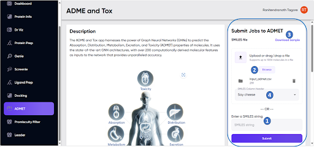

# User inputs

- The user input area is marked in Figure A1 by the blue rectangle. The user inputs the molecules for which the ADMET properties are to be predicted. This can be done either one molecule at a time, with a single SMILES string for the intended molecule entered in the “Enter a SMILES string” field (Figure A1, “1”), or as a .csv file containing the SMILES strings for a set of molecules in a single column, via the “Browse” button (Figure A1, “2”). 

- The “Download Sample” option **(Figure A1, “3”)** provides an example of the input file. Once an input .csv file is selected, the column containing the SMILES strings can be specified by the user in the “SMILES column header” field **(Figure A1, “4”)**. This enables the use of input files with multiple columns of data, if desired.    

**Figure A1**. The ADMET module screen, with the user input panel marked within the blue box. The field for input of a single SMILES, the “Browse” button for uploading .csv files of SMILES, link for downloading sample input files, and the field for specifying the column containing the SMILES strings in the input .csv file, are marked as “1”, “2”, “3”, and “4”, respectively.

