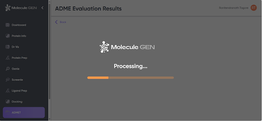
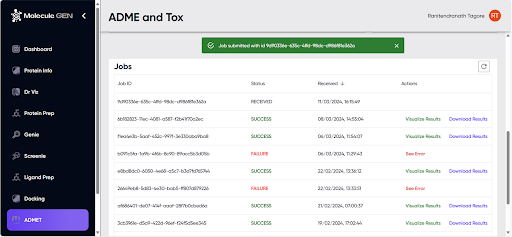

# Job Submission

If a job is submitted via the “Enter a SMILES string” option, a progress screen is shown while the job is processing (Figure A2). If a job is submitted via the “Browse” option, the job is added to the submitted jobs list with a message acknowledging the successful submission (Figure A3). As shown in Figure A3, completed jobs have a status of either “SUCCESS” or “FAILURE”, while jobs in progress have a “RECEIVED” status. The refresh icon at the top right of the jobs table can be used to check for completion of a “RECEIVED” job.

**Figure A2**. Progress screen upon submitting a job via the “Enter a SMILES string” option. 

**Figure A3**. Acknowledgment screen upon submitting a job via the “Browse” option.

