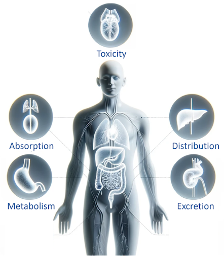

# Introduction

**ADMET** is a highly accurate tool for the prediction of ADMET properties of small molecules.

### Description

The ADME and Tox app harnesses the power of Graph Neural Networks (GNNs) to predict the Absorption, Distribution, Metabolism, Excretion, and Toxicity (ADMET) properties of molecules. It uses the state-of-the-art GNN architectures, with over 200 computationally derived molecular features as inputs to the network that provides unparalleled accuracy.

