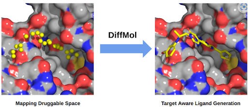

# Introduction

- Genie-DiffMol is a target-aware diffusion-based de novo ligand generation module.
- Genie-DiffMol generates novel ligands that are optimally suited to bind to specified binding sites within a given protein.

## User inputs

### Option 1
- **Protein Structure (.pdb file)**:Upload the .pdb file containing the protein structure for which ligands are to be generated.
- **Ligand Structure (.sdf file)** : Provide the .sdf file of the ligand, ensuring it reflects the conformation where the ligand is bound to the target site on the provided protein structure. This is essential for accurately identifying the ligand binding site on the protein.

### Option 2
- **Protein Pocket (.pdb file)** : A PDB file containing the residues of the target protein's ligand-binding cavity or other druggable pockets of interest, against which ligands are to be generated.

