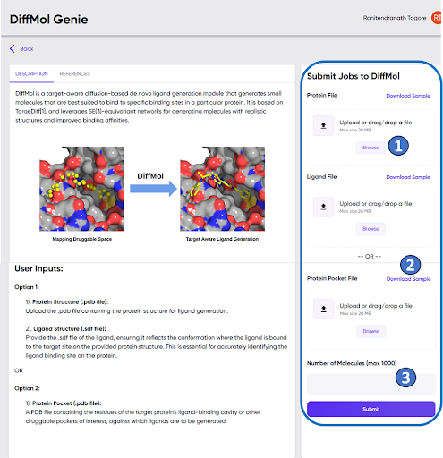

# Usage

- These files can be loaded into Genie-DiffMol using the “Browse” buttons in the user input panel, and sample input files can be downloaded by clicking the “Download Sample” links (Figure GD1).

- **Figure GD1**. The Genie-DiffMol module screen, with the user input panel marked within the blue box. Instances of “Browse” buttons for uploading files, links for downloading sample input files, and the field for specifying the number of molecules desired, are marked as “1”, “2”, and “3”, respectively.

**Note**: Genie-DiffMol requires knowledge of the binding pocket for target-aware ligand generation. With Option 1, Genie-DiffMol infers the binding pocket from the geometric information in the protein and ligand files (see cautionary note below). In contrast, with Option 2, the user directly provides the binding pocket.

***Therefore, when choosing Option 1, the protein and ligand files must be in the same coordinate system. For example, the protein and ligand files may be prepared by separating the ligand and protein from a .pdb of a complex between the two.***

- After uploading the input files (either Option 1 or Option 2), the user needs to enter an integer numerical value in the “Number of Molecules” field (marked “3” in Figure GD1). This is the number of molecules that the user wishes to generate, and 1000 is the maximum value that can be entered (see cautionary note below).

**Note** : The number of molecules actually generated may be less than the number entered. Therefore, the user may consider entering a number larger than the number of molecules minimally required.

***After specifying the number of molecules, the molecule generation task is ready to be submitted by clicking the “Submit” button at the bottom of the user input panel (Figure GD1).***

To Submit a Job to ***Genie-DiffMol***
1) Upload input files (Option 1 or Option 2).
2) Specify the number of molecules.
3) Click “Submit”.