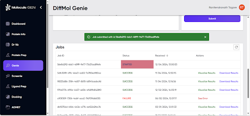

# Outputs

When the “Submit” button is clicked, a green pop-up message appears, mentioning the Job ID (Figure GD2). At the same time, the submitted job gets listed in the table of jobs below the pop-up message. The job table consists of five columns, four of which are visible in Figure GD2, and are self-explanatory. A fifth column, which can be seen upon scrolling to the right, is “Job Details”, under which a “Show” button provides the option to list the inputs (the number of molecules specified, and the names of the submitted files) given for the job.

**Figure GD2**. Job submission pop-up message and tabular list of jobs.

- Once the job is successfully executed, as indicated in the “Status” column, the user can go to the “Actions” column to visualise the results or the error message (in case the job has failed). 

***Refresh the browser page (or just the jobs table by using the refresh button on the top right of the table) to see the updated status.***

Upon clicking on “Visualize Results”, the user is taken to the “Screenie” module, and detailed information on the generated ligands is displayed (see the “Screenie” section of this manual for details).

After submitting a job to ***Genie-DiffMol***:
1. The job gets added to the “Jobs” list, with the job status and other information displayed.
2. Once the status changes to “SUCCESS” (page or jobs table needs to be refreshed), the user can visualise the results of the job.
